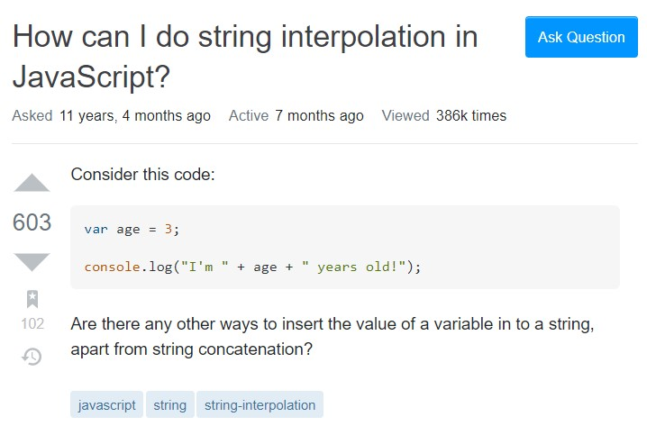
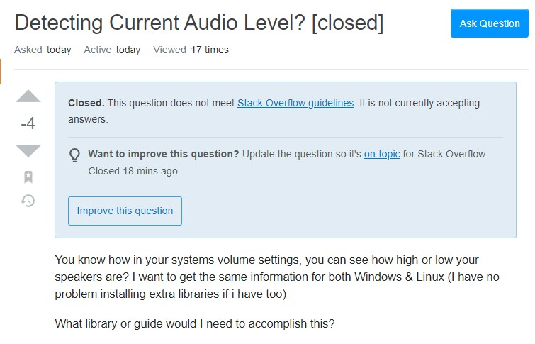

## Looking for Help
Learning to code and the many different languages available can cause many stress to any newcomers to coding. Often they find themselves searching the internet for the answers. When asking these questions over the internet, it is important to ask "smart" questions as you want to have efficient communcation from both parties. You can read an [essay](http://www.catb.org/esr/faqs/smart-questions.html) written by Eric Raymond who lists effective and efficient methods for clear communication with the open source community. 

## Smart Questions

 

An example of a smart question would be something similar to [this question](https://stackoverflow.com/questions/tagged/javascript?sort=Newest&edited=true). One reason that this question is a smart question is because the author is asking the question using specific vocabulary, showing that the author knows some information about the topic being asked. This allows everyone else to know what the author is asking for and saves them time from asking any additional questions and can provide a solution. Another reason that makes this question "smart" is that the tags the author provides makes it easy for anyone else with the same question to be able to find the solution without having to ask someone else. Lastly, since the question is generic (did not rely on any context of what kind of program the author is trying to run), the question will be applicable to others with the same question.

## Not so smart questions

An example of a bad question would be something similar to [this question](https://stackoverflow.com/questions/65950918/detecting-current-audio-level). I consider this a not so smart question becuase the question does not provide exact details on what is trying to be accomplished. It sounds like he wants to adjust the volume but does not explain stuff like what kind of tool he wants to use to access the volume information. To turn this into a smarter question, I would suggest he add some context on why he needs the information or what exact programs he is currently using. It just remains unclear on what he needs and leaves confusion for both the author and readers.

## Communication is important

Overall, it is important for both newcomers and veterans to programming to ask "smart" questions. We can see that with efficient communcation, the time saved from asking more and more questions is crucial. As we know, time is of the esscence for any aspiring software developer. It is important to note that asking questions is never a bad idea, even if you think it's a "stupid" question. Nothing beats that feeling of finally getting your code to work after many attempts in trying to solve it on your own.

