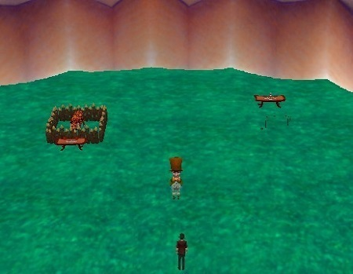
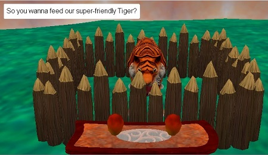
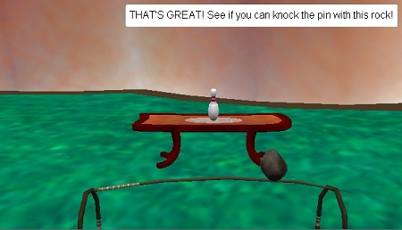
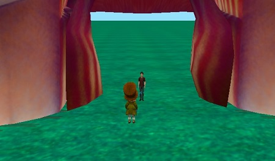

  
  
  
  

I created a game where the player goes to a circus and gets to interact with the different stalls. The player gets to choose between feeding a tiger or knocking down a pin with a rock. For each event, the player also gets to choose the total food/power used when playing which allows for multiple possibilities. This project was created using the application "Alice 3", which is a program that acted as an introduction to Java Programming. 

I found the process in making the game a fun experience as I had all the freedom to make anything I desired. Making the game ultimately led to me wanting to major in Computer Science. It helped me learn the basic programming concepts such as data types, objects, variables, arrays, loops, etc.

Source code for this project will be made available at a later date.
