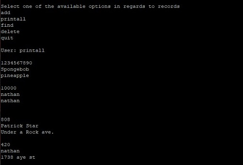

One of my ICS 212 projects required to make a bank user-interface using the C programming language. The program is to allow the user to add, delete, print, and find records of information stored in a database that gets updated each time you run the program. 

This project was difficult as the C programming languge introduced me to a new concept called pointers. The project helped me develop an understanding of pointers and addresses, as well as memory management.

Source code for this project will be made available soon.
