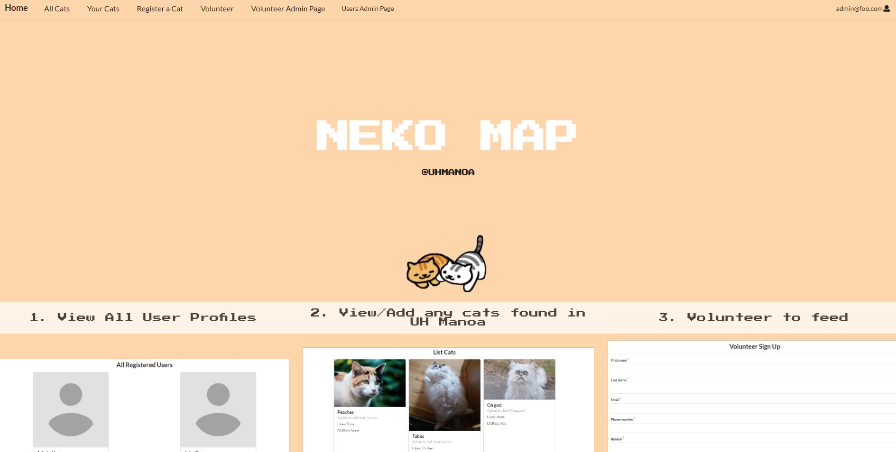
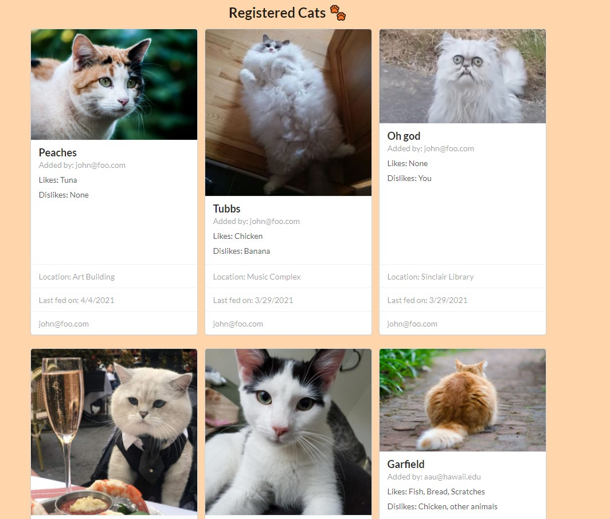
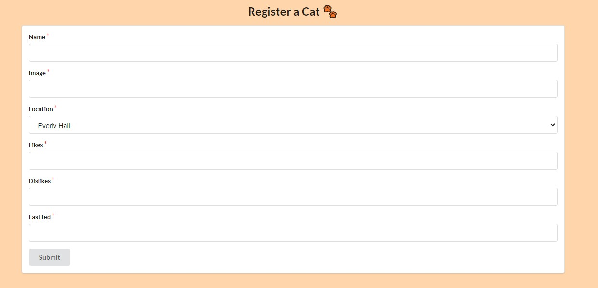
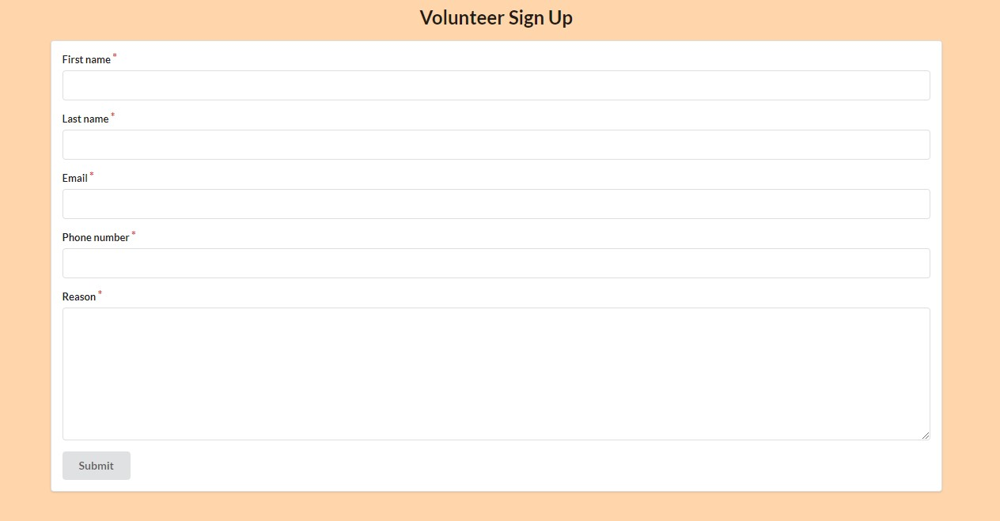

For my ICS 314 Final Project, my team (Michelle Luu, Thane Luna, Micah Imakyure) and I created a website application that allowed users to track cats on the UH Manoa campus. The main goal of this website application is to help the UH Manoa community have a system that allows them to better take care of the stray cats found on campus. 

The main feature of the website is to be able to map the cats on campus using a form. Users will fill out information that is visible to everyone so that the general location of the cats is known. Making it easier for the community to find and feed the cats.

Another feature of the website is a volunteer form for users who want to volunteer to feed the cats. When users fill out the volunteer form, the admins of the site will be able access their contact information and provide them more details on which cats to help feed.

My main contributions to the project was creating the landing page and the volunteer admin page. I also contributed to helping fix bugs and issues to the pages assigned to my group members when needed.

The main thing I learned from this project was the overall process of creating a website. From obtaining the url address, using digital ocean to host the server of the website, to connecting the database to the website. I was always interested on the process of making a website and now glad to have the experience in making one under my belt.

Source code for this project can be found [here](https://github.com/neko-map/neko-map-app).

[Neko-Map Website Link (server will soon go down)](https://neko-map.xyz/#/)

