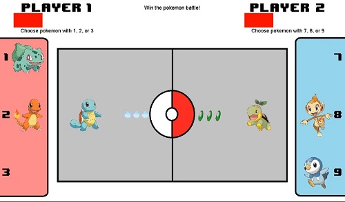

For my ICS 111 Final Project, I made a pokemon themed rock-paper-scissors game with a friend. The game behaves like rock-paper-scissors but uses the fire, water, and grass types instead. It is a two player game where both players selects the pokemon they want to send out and battles. Pokemon with the type advantage wins. The players keeps playing until one side loses their entire health bar. 

I learned alot from this project as it focused on core concepts of programming such as duplication of objects via classes. Collaborating with a friend also improved my communication skills as we were brain storming ideas for the project. In the end, we were both really satisfied with what we produced.

Source code for this project will be made available soon.

[Youtube Demo](https://www.youtube.com/watch?v=M7_n76qbwCU&feature=youtu.be)
