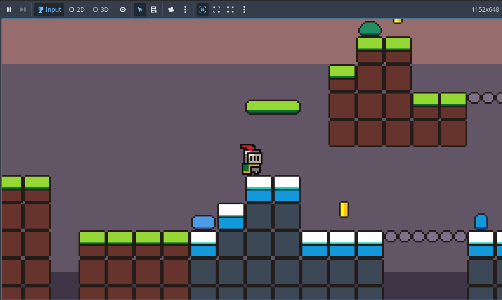
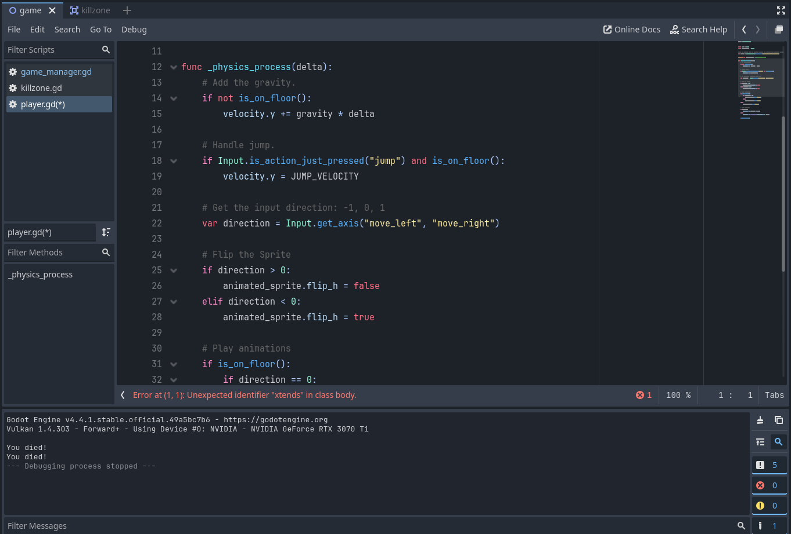
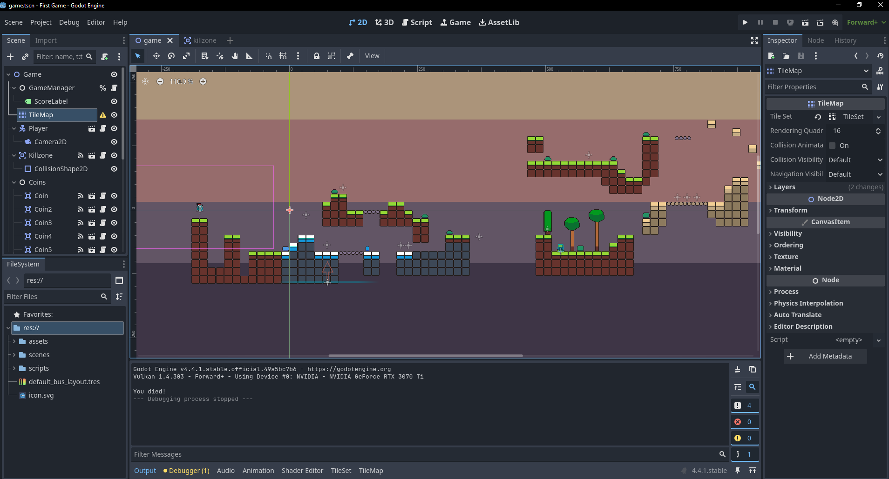
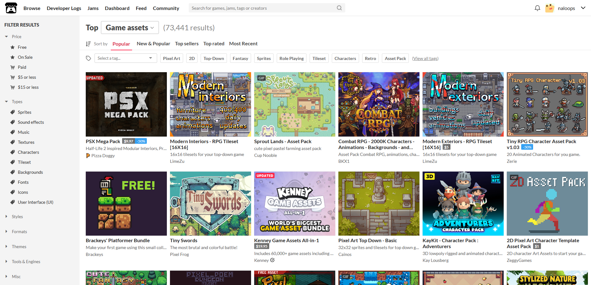

One of my goals is to one day release a fully fleshed out game on Steam (game platform). For the first step towards that goal, 
I have developed a simple platformer game in order to learn the basics of using the Godot game engine. 

Within the Godot game engine, it has a built in programming language called GDScript. 
GDScript is considered to be a simple and beginner friendly programming language (resembles closest to python).

Within this small game, my main takeaways that I learned was how to make a Sprite2D node move in any direction, 
utilize tilemaps to create a world for the player, 
and implement collision shapes that performs different actions when colliding with different objects.

Lastly, instead of developing my own art and sound assets, I obtained free resources from itch.io to help save time and allow me to focus solely on the coding side of the project. 

