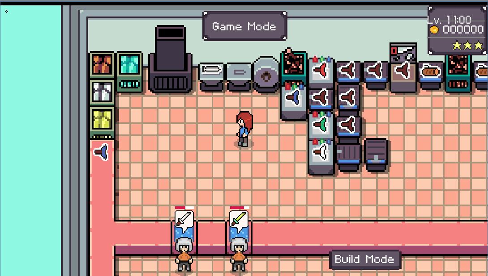
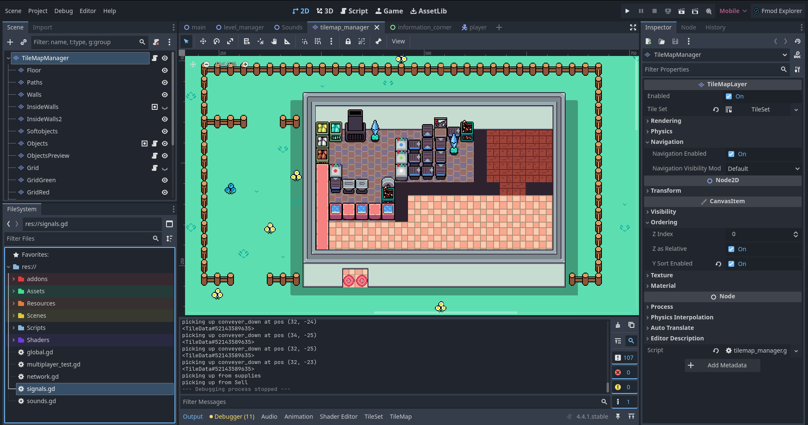
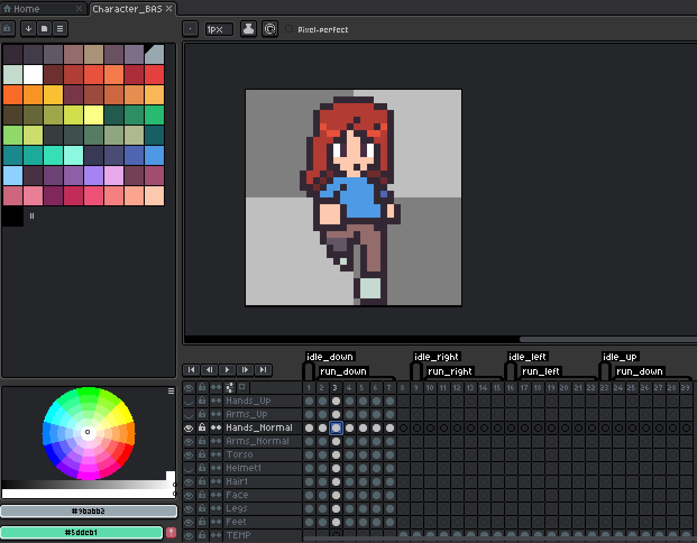
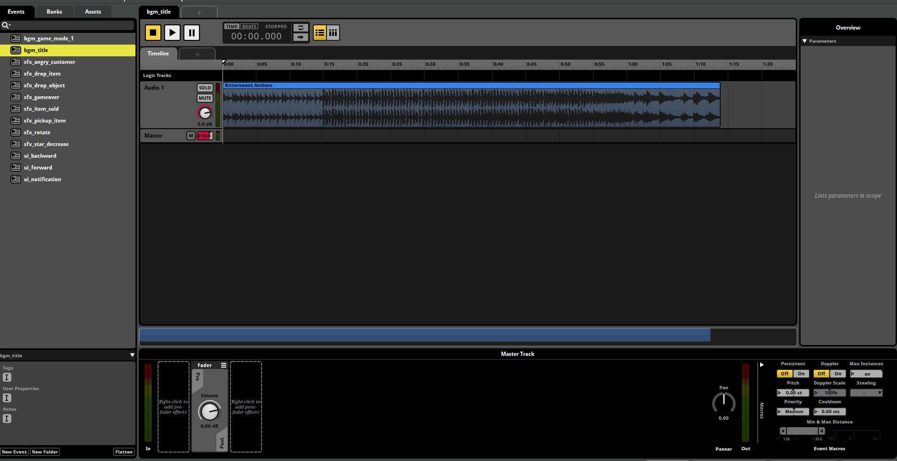

For the past year, I have been developing a shop simulation / management game on my own. In this game, players will manage their shops in an RPG setting. 
The goal for the player is to create weapons / potions for customers who enter their shops.
The main inspiration for this game is from a different game called "Plate Up".

The game is being created using the Godot game engine software that uses GDScript as it's main programming language. 
GDScript is a built in programming language within Godot that mostly resembles Python.

I utilized another software called Aseprite to help create pixel art for my game. Aseprite allows me to control animations and the current states of players / objects with the game.

Lastly, I am using FMOD to help manage sound effects and music that I am using for my game.

A youtube demo of my game can be found [here](https://www.youtube.com/watch?v=qNZutxtstAk).

