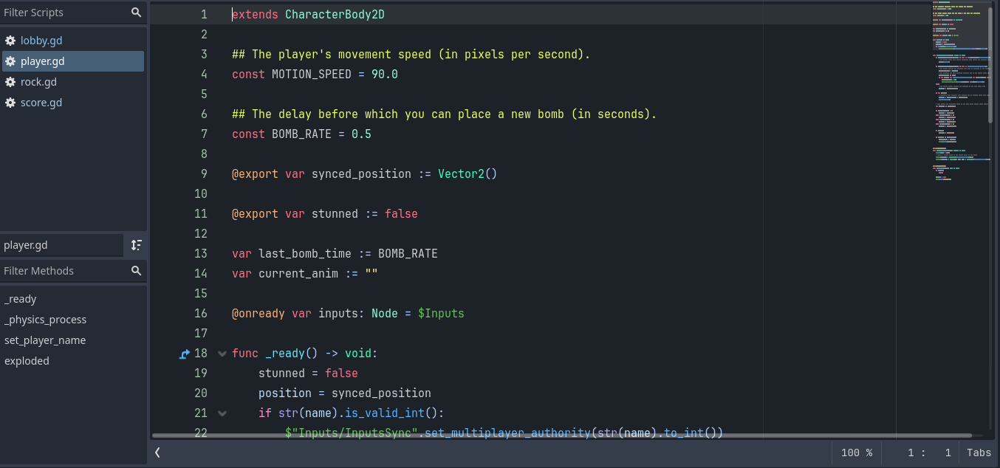

Before I begin developing my dream game, I wanted to practice using godot for one more project. Since I plan on my dream game to have top-down movement, 
I want this second project to at least contain a player controller script that moves the character as if it was in a top-down world so that I may reuse the script in the future.
Therefore, I settled on recreating a level from the bomberman series as it also contains top-down movement.

In my previous project, the player script could move the character left/right, jump up, and fall down. This is due to player node having gravity enabled which allowed the character to keep falling until colliding with a collision shape attached to the tilemap.
However, by disabling the gravity and jump action, the player script can now look as if the character is moving up and down from a top-down view.

Lastly, I learned how to create instances of a scene node (rocks) node to easily duplicate rocks around the map that have the same properties as the original. 

