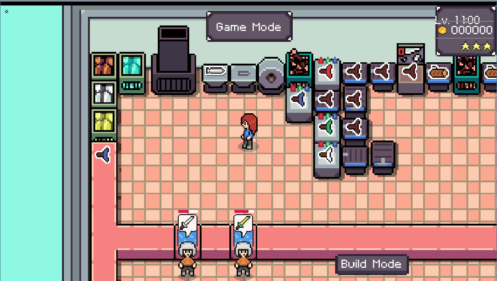
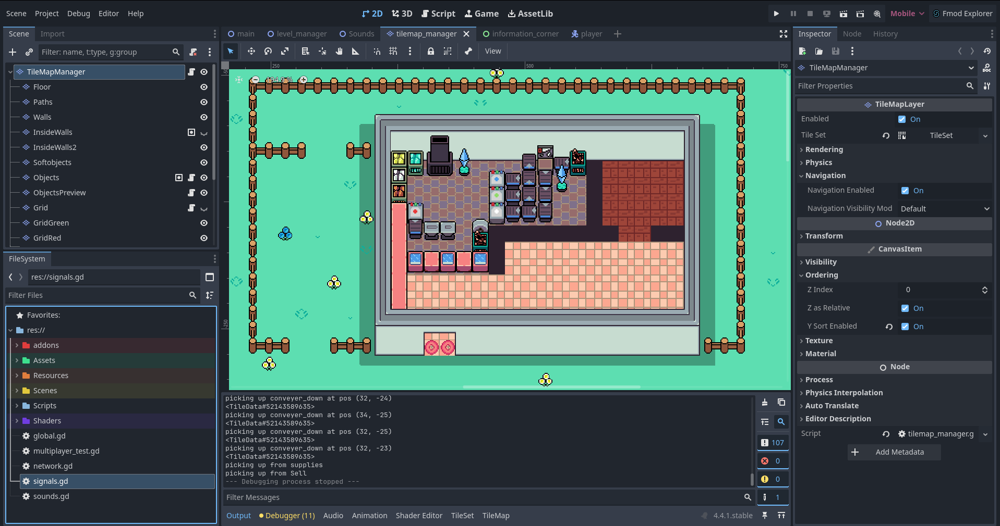

For the past year, I have been developing a shop simulation / management game on my own. In this game, players will manage their shops in an RPG setting with rogue-like features. 
The goal for the player is to create and sell weapons to customers before their patience run out. The player would then use money they make to improve the size and efficiency of their store as big as they can before they run out of lives.
The main inspiration for this game came from another video game called "Plate Up". A youtube demo of the game can be found [here](https://www.youtube.com/watch?v=qNZutxtstAk).

The game is being created using the Godot game engine software that uses GDScript as it's main programming language. 
GDScript is a built in programming language within Godot that mostly resembles Python.

In previous game dev projects, I used free art and sound assets found on itch.io. However, this time everything including code, art, sfx, music, etc. has been developed by me alone.
For the art assets, I utilized a software called Aseprite to help create pixel art for my game. Aseprite contains helpful features that allow me to control animations and the current states of players / objects within the game.

For sound, I am using both FMOD and beepbox to help manage sound effects and music that I am using inside my game.

